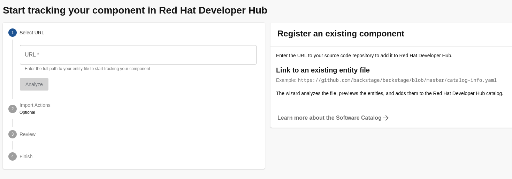

# rhdh-exercises


## Start customizing 

create mandatory backend secret
we also add the basedomain to make it dynamic

```sh
oc apply -f ./custom-app-config-gitlab/rhdh-secrets.yaml -n rhdh-gitlab
export basedomain=$(oc get ingresscontroller -n openshift-ingress-operator default -o jsonpath='{.status.domain}' | base64 -w0)
oc patch secret rhdh-secrets -n rhdh-gitlab -p '{"data":{"basedomain":"'"${basedomain}"'"}}'
```

enable custom app-config

add this configmap and secrets to the rhdh manifest:

```yaml
spec:
  application:
    appConfig:
      configMaps:
      - name: app-config-rhdh
    extraEnvs:
      secrets:
        - name: rhdh-secrets       
```


```sh
oc apply -f ./custom-app-config-gitlab/rhdh-app-configmap.yaml -n rhdh-gitlab
oc apply -f ./custom-app-config-gitlab/rhdh-instance.yaml -n rhdh-gitlab
```

## Enable gitlab authentication

create a [new application](https://backstage.io/docs/auth/gitlab/provider)
- the call back uri should look something like: https://backstage-developer-hub-rhdh-gitlab.apps.cluster-b4w6n.dynamic.redhatworkshops.io/api/auth/gitlab/handler/frame
- set the correct permissions

create a secret with a app id and secret

```yaml
kind: Secret
apiVersion: v1
metadata:
  name: github-secrets
  namespace: rhdh
data:
  AUTH_GITLAB_CLIENT_ID: xxx
  AUTH_GITLAB_CLIENT_SECRET: xxx
type: Opaque
```
modify app config with the new secret

```yaml
    app:
      title: Red Hat Developer Hub
    signInPage: gitlab   
    auth:
      environment: development
      providers:
        gitlab:
          development:
            clientId: ${AUTH_GITLAB_CLIENT_ID}
            clientSecret: ${AUTH_GITLAB_CLIENT_SECRET}
```   

notice that we set the signInPage to gitlab, the default is github. To disable guest login set the environment to production.

add the new secret to the backstage manifests

```yaml
spec:
  application:
    ...
    extraEnvs:
      secrets:
        - name: github-secrets 
```

or execute

```sh
oc apply -f ./custom-app-config-gitlab/rhdh-app-configmap-1.yaml -n rhdh-gitlab
oc apply -f ./custom-app-config-gitlab/rhdh-instance-1.yaml -n rhdh-gitlab
```

Verify that you can login with gitlab 

## Enable gitlab plugin integration

create new PAT with [these permissions](https://backstage.io/docs/integrations/gitlab/locations)

add the PAT to the previously created github-secrets secret

```yaml
kind: Secret
apiVersion: v1
metadata:
  name: github-secrets
  namespace: rhdh
data:
  AUTH_GITLAB_CLIENT_ID: xxx
  AUTH_GITLAB_CLIENT_SECRET: xxx
  GITLAB_TOKEN: xxx
GITLAB_TOKEN:
type: Opaque
```

add the following to the appconfig configmap

```yaml
kind: ConfigMap
apiVersion: v1
metadata:
  name: app-config-rhdh
data:
  app-config-rhdh.yaml: |
    app:
      title: Red Hat Developer Hub
    integrations:
      gitlab:
        - host: gitlab.${basedomain}
          token: ${GITLAB_TOKEN}
          apiBaseUrl: https://gitlab.${basedomain}/api/v4
          baseUrl: https://gitlab.${basedomain}          
```      

or execute

```sh
oc apply -f ./custom-app-config-gitlab/rhdh-app-configmap-2.yaml -n rhdh-gitlab
```


## add gitlab autodiscovery

create a new configmap with the needed dynamic plugin

```sh
oc apply -f ./custom-app-config-gitlab/dynamic-plugins-3.yaml -n rhdh-gitlab
```

add this to the app config configmap:

```yaml
catalog:
  providers:
    gitlab:
      yourProviderId:
        host: gitlab.${basedomain} # Identifies one of the hosts set up in the integrations
        apiBaseUrl: https://gitlab.${basedomain}/api/v4
        branch: main # Optional. Used to discover on a specific branch
        fallbackBranch: main # Optional. Fallback to be used if there is no default branch configured at the Gitlab repository. It is only used, if `branch` is undefined. Uses `master` as default
        skipForkedRepos: false # Optional. If the project is a fork, skip repository
        entityFilename: catalog-info.yaml # Optional. Defaults to `catalog-info.yaml`
        projectPattern: '[\s\S]*' # Optional. Filters found projects based on provided patter. Defaults to `[\s\S]*`, which means to not filter anything
        schedule: # optional; same options as in TaskScheduleDefinition
          # supports cron, ISO duration, "human duration" as used in code
          frequency: { minutes: 1 }
          # supports ISO duration, "human duration" as used in code
          timeout: { minutes: 3 }
```

```sh
oc apply -f ./custom-app-config-gitlab/rhdh-app-configmap-3.yaml -n rhdh-gitlab
```

update  the backstage manifest to use the new configmap for plugins

```yaml
spec:
  application:
  ...
    dynamicPluginsConfigMapName: dynamic-plugins-rhdh
```    

```sh
oc apply -f ./custom-app-config-gitlab/rhdh-instance-3.yaml -n rhdh-gitlab
```

verify that the `sample-service` component is in the application catalog

## enable users/teams autodiscovery

add this to the configmap:

```yaml
  catalog:
    providers:
      gitlab:
        yourProviderId:
          host: gitlab.${basedomain}
          orgEnabled: true
          group: org/teams # Required for gitlab.com when `orgEnabled: true`. Optional for self managed. Must not end with slash. Accepts only groups under the provided path (which will be stripped)
          groupPattern: '[\s\S]*'
```

```sh
oc apply -f ./custom-app-config-gitlab/rhdh-app-configmap-4.yaml -n rhdh-gitlab
```

ATTENTION: this step is broken due to this [issue](https://issues.redhat.com/browse/RHIDP-1713).
We will emulate what the processor would have done by uploading the users-groups.yaml to backstage:



verify that users and teams are discovered

## enable RBAC

enable permissions by updating app-config

```yaml
permission:
  enabled: true
  rbac:
    admin:
      users:
        - name: user:default/1   
    policies-csv-file: /permissions/rbac-policy.csv
```

mount the new file in the backstage manifests

```yaml
    extraFiles:
      mountPath: /opt/app-root/src
      configMaps:
        - name: rbac-policy
          key: rbac-policy.csv
```

create a new permission file, see permission-configmap-5.yaml

```sh
oc apply -f ./custom-app-config-gitlab/permission-configmap-5.yaml -n rhdh-gitlab
oc apply -f ./custom-app-config-gitlab/rhdh-app-configmap-5.yaml -n rhdh-gitlab
oc apply -f ./custom-app-config-gitlab/rhdh-instance-5.yaml -n rhdh-gitlab
```

verify that user2 cannot see `sample-service` anymore